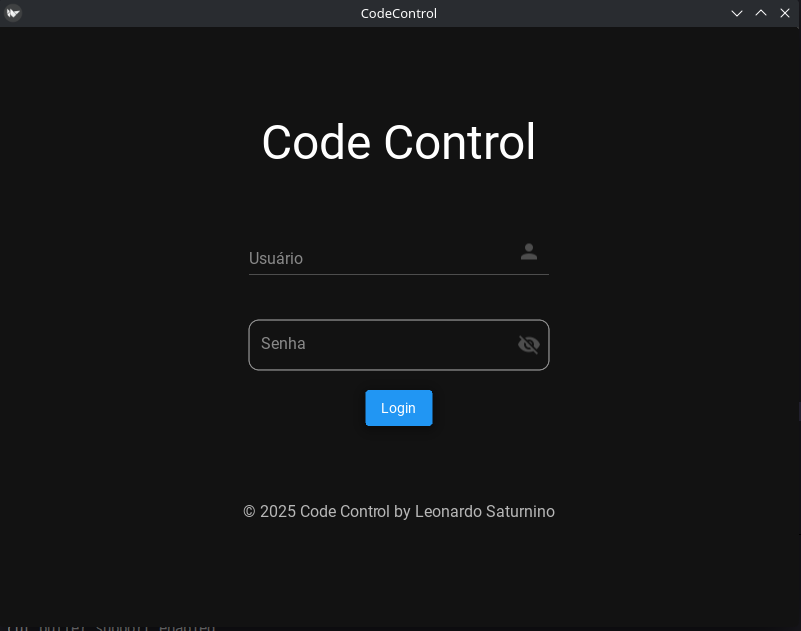
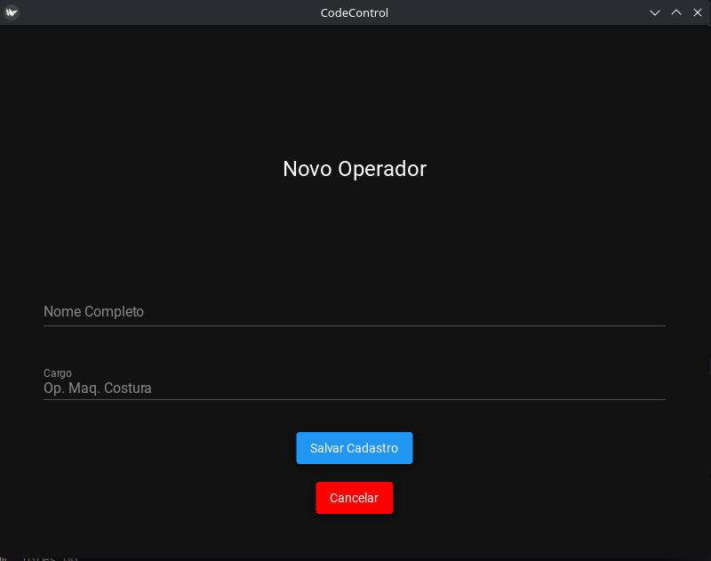
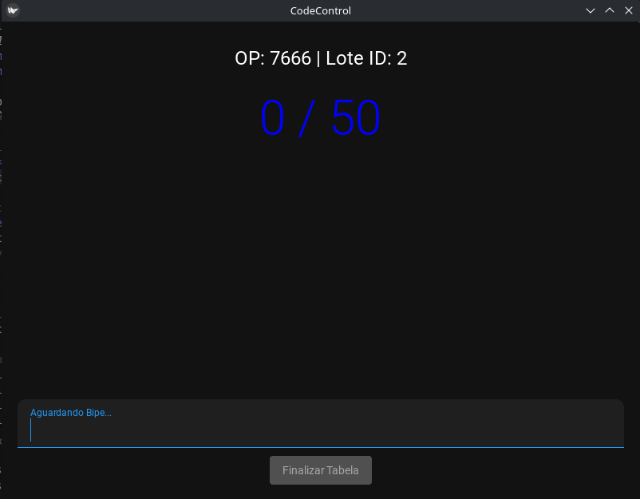
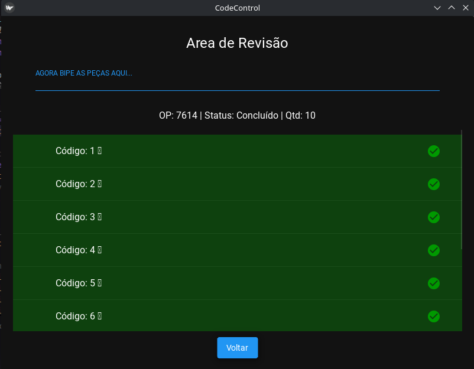
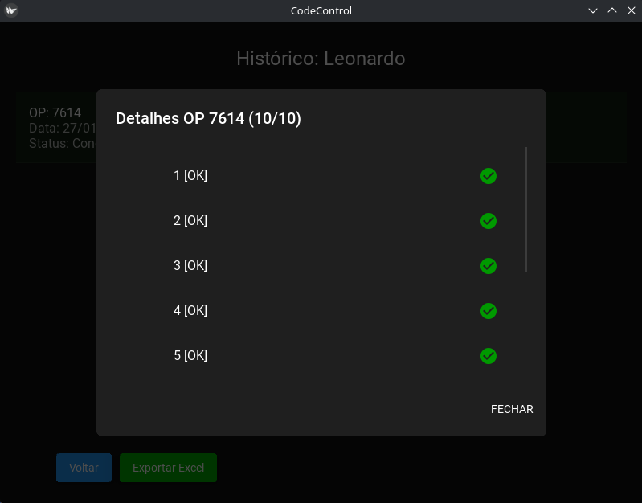
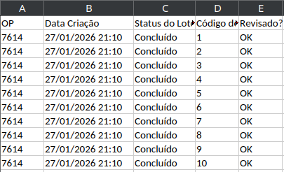

# 📦 Code Control: Rastreabilidade e Auditoria Industrial


> **Solução Desktop para gestão de inventário, controle de lotes e auditoria de produção em ambiente industrial.**

---

## 🏭 O Desafio de Negócio
No cenário de produção de **Big Bags**, a divergência entre a produção física e os registros sistêmicos gera perdas financeiras e gargalos logísticos. O processo manual de conferência é suscetível a falhas humanas, duplicidade de registros e dificuldade em rastrear a origem dos erros.

## 💡 A Solução: Code Control
O **Code Control** foi desenvolvido para digitalizar e auditar esse processo. O sistema atua como uma barreira de qualidade, permitindo:

* **Rastreabilidade:** Associação de cada lote de produção (50 itens) a um operador específico.
* **Auditoria em Rede:** Banco de dados centralizado permitindo conferência simultânea pelo setor de Análise.
* **Prevenção de Erros:** Bloqueio automático de códigos duplicados ou inexistentes.
* **Gestão à Vista:** Relatórios automáticos para tomada de decisão gerencial.

---

## 📸 Visão Geral do Sistema

### 1. Segurança e Acesso
Sistema de login autenticado para diferenciar níveis de permissão (Administrador vs. Analista).

<div align="center">
  
</div>

### 2. Gestão de Pessoal
**Cadastro de Operadores:** Módulo para registro dos colaboradores da linha de produção, fundamental para a rastreabilidade e métricas de produtividade individual.

<div align="center">
  
</div>

### 3. Controle de Produção
**Cadastro de Lote:** O administrador cria lotes de códigos (ex: agrupamentos de 50 etiquetas). O sistema garante que esses códigos entram no banco de dados prontos para validação, evitando inserção manual errada posteriormente.

<div align="center">
  
</div>

### 4. Auditoria em Tempo Real
**Tela de Conferência:** O "coração" do sistema. O analista bipa ou digita os códigos dos Big Bags físicos.
* ✅ **Verde:** Código validado e contabilizado.
* ❌ **Erro:** Código duplicado ou não pertencente ao lote.
* 📊 **Status:** Barra de progresso visual do lote.

<div align="center">
  
</div>

### 5. Histórico e Logs
Visualização completa de todas as movimentações, permitindo auditoria retroativa em caso de dúvidas sobre um lote fechado.

<div align="center">
  
</div>

### 6. Inteligência de Dados
**Exportação de Relatórios:** Utilizando a biblioteca **Pandas**, o sistema compila os dados brutos em planilhas Excel (.xlsx) formatadas, detalhando a eficiência por turno, operador e lote.

<div align="center">
  
</div>

---

## 🛠️ Tecnologias Utilizadas

* **Linguagem:** Python 3.10+
* **Interface Gráfica (GUI):** KivyMD (Material Design) - Focado em interfaces touch-friendly e responsivas.
* **Banco de Dados:** SQLite 3 - Implementado em arquitetura de rede local para acesso simultâneo leve.
* **Análise de Dados:** Pandas & OpenPyXL - Para processamento de DataFrames e geração de relatórios gerenciais.

## 🚀 Como Executar o Projeto

```bash
# Clone este repositório
$ git clone [https://github.com/SEU-USUARIO/code-control.git](https://github.com/SEU-USUARIO/code-control.git)

# Acesse a pasta do projeto
$ cd code-control

# Crie um ambiente virtual (Recomendado)
$python -m venv venv$ source venv/bin/activate  # No Windows: venv\Scripts\activate

# Instale as dependências
$ pip install -r requirements.txt

# Execute a aplicação
$ python main.py
screens/
